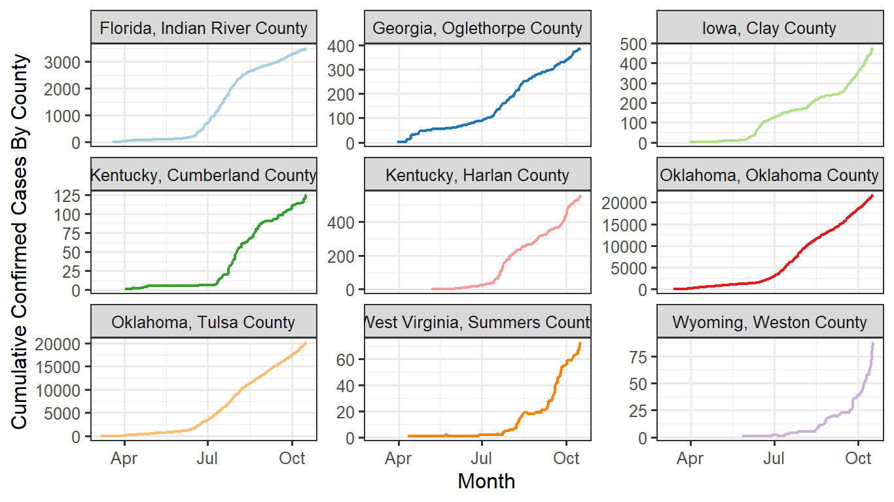
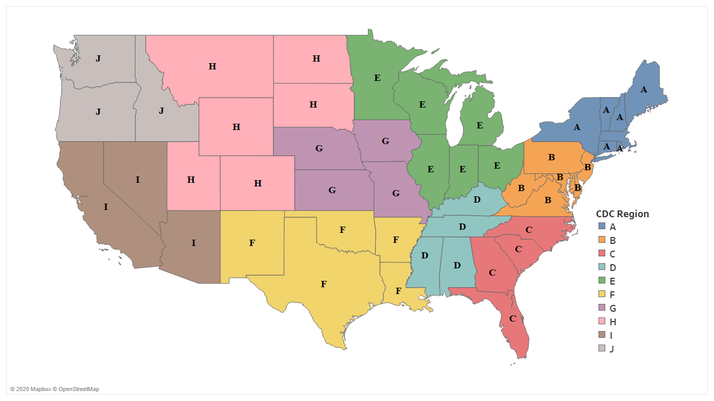
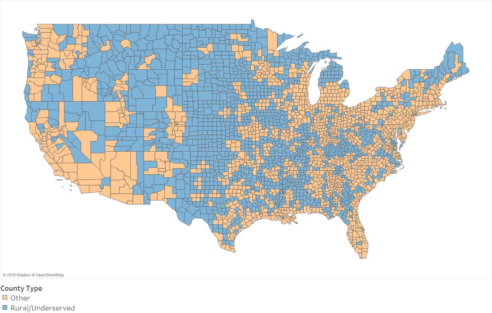
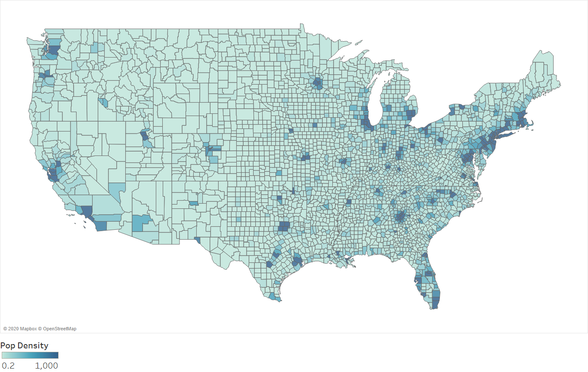
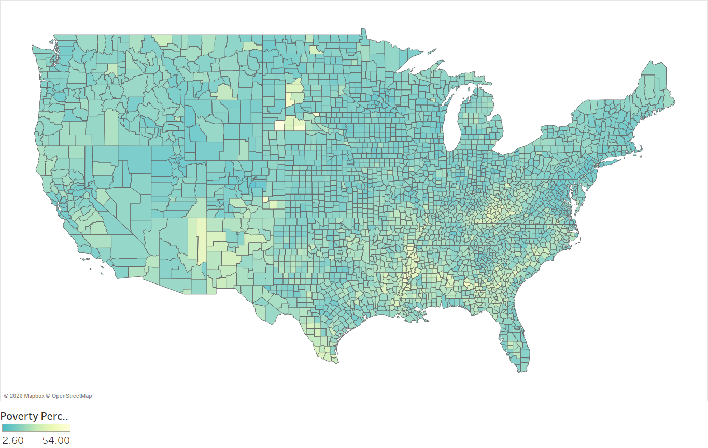
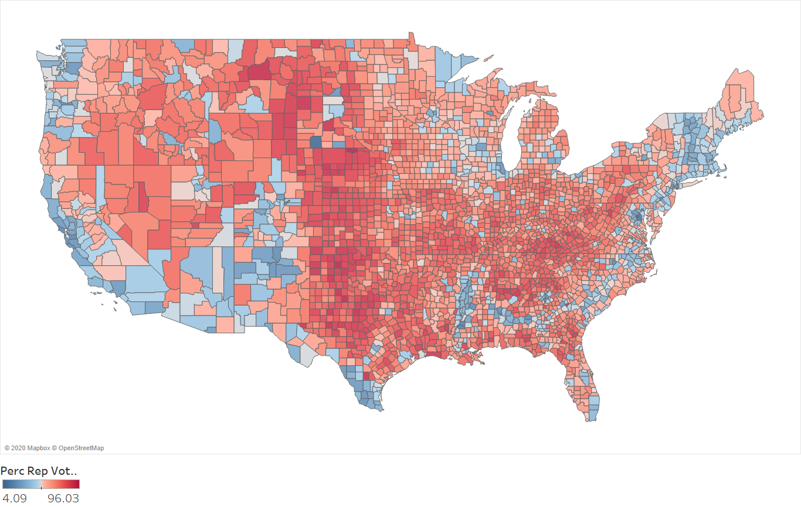
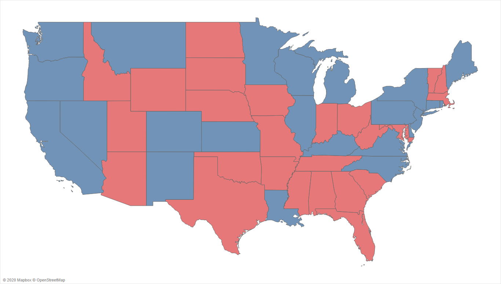
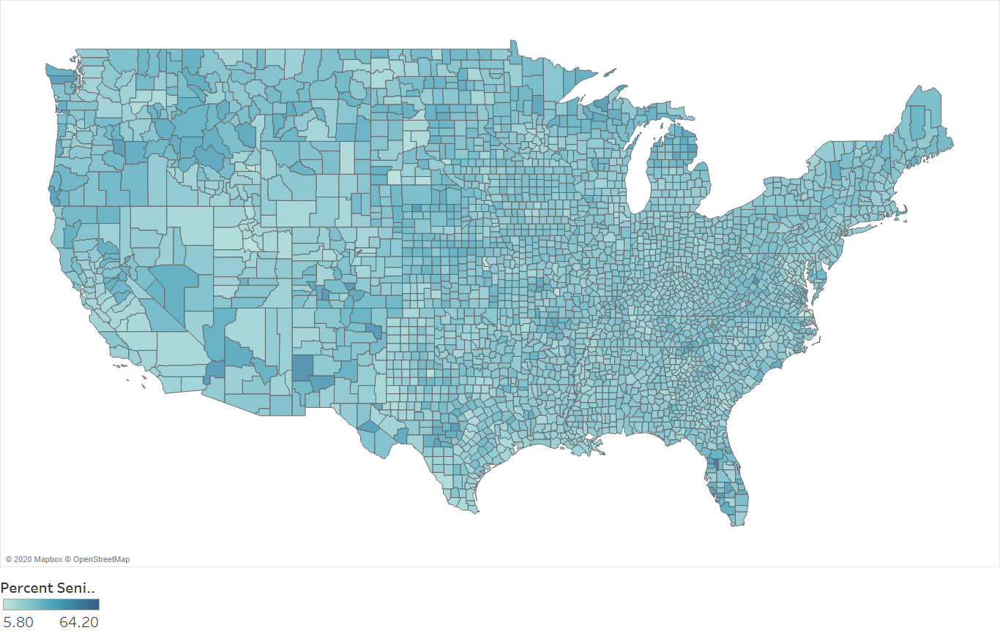

```{r setup, include=FALSE}
knitr::opts_chunk$set(echo = TRUE,
                      warning = FALSE,
                      message = FALSE,
                      cache = TRUE,
                      progress = FALSE, 
                      verbose = FALSE,
                      dpi = 600)
options(qwraps2_markup = "markdown")
```

# R Setup and Required Packages
In this project, the open-source R programming language is used to model the progression in the COVID-19 pandemic in different U.S. counties. R is maintained by an international team of developers who make the language available at [The Comprehensive R Archive Network](https://cran.r-project.org/). Readers interested in reusing our code and reproducing our results should have R installed locally on their machines. R can be installed on a number of different operating systems (see [Windows](https://cran.r-project.org/bin/windows/), [Mac](https://cran.r-project.org/bin/macosx/), and [Linux](https://cran.r-project.org/bin/linux/) for the installation instructions for these systems). We also recommend using the RStudio interface for R. The reader can [download RStudio](http://www.rstudio.com/ide) for free by following the instructions at the link. For non-R users, we recommend the [Hands-on Programming with R](https://rstudio-education.github.io/hopr/packages.html) for a brief overview of the software's functionality. Hereafter, we assume that the reader has an introductory understanding of the R programming language.

In the code chunk below, we load the packages used to support our analysis. Note that the code of this and any of the code chunks can be hidden by clicking on the 'Hide' button to facilitate the navigation.

```{r packages, cache=FALSE}
if(require(pacman)==FALSE) install.packages("pacman") # check to see if the pacman package is installed; if not install it
if(require(devtools)==FALSE) install.packages("devtools") # check to see if the devtools package is installed; if not install it

# to check and install if these packages are not found locally on machine
if(require(albersusa)==FALSE) devtools::install_github('hrbrmstr/albersusa') #install package if needed
if(require(albersusa)==FALSE) devtools::install_github('dreamRs/r2d3maps') #install package if needed


# check if packages are not installed; if yes, install missing packages
pacman::p_load(tidyverse, magrittr, dataPreparation, recipes, doParallel, psych, skimr, VIM, reshape2, # for data analysis
               COVID19, rvest, readxl, # to get county level COVID19 data, scrape Wikipedia, and load xls files
               DT, stargazer, # used for having nicely formatted outputs in Markdown
               zoo, fpp2, dtwclust, factoextra, TSclust, proxy, NbClust, # for TS analysis and clustering 
               DataExplorer, scales, ggdendro, gridExtra, RColorBrewer, raster, GGally,# for plotting
               leaflet, webshot, albersusa, tigris, plotly, r2d3maps,# for mapping
               caret, caretEnsemble, AUC, caTools, DMwR, MLmetrics, # ML packages
               rpart, nnet, naivebayes, # rpart, nnet, and multinom packages
               conflicted)

# Handling conflicting function names from packages
conflict_prefer('combine', 'dplyr') # Preferring dplyr::combine over any other package
conflict_prefer('select', "dplyr") #Preferring dplyr::select over any other package
conflict_prefer("summarize", "dplyr") # similar to above but with dplyr::summarize
conflict_prefer("filter", "dplyr") # Preferring filter from dplyr
conflict_prefer("dist", "stats") # Preferring dist from stats
conflict_prefer("as.dist", "stats") # Preferring as.dist from stats


set.seed(2020) # to assist with reproducibility
sInfo = sessionInfo()
```

# Extracting U.S. Counties' Data & Computing their New Cases/Deaths

For our analysis, we fuse data from multiple sources. We describe the process of obtaining and merging each of these sources in the subsections below.


## Data based on the COVID19 Package
In this section, we utilize the [COVID19 package](https://cran.r-project.org/web/packages/COVID19/COVID19.pdf) to obtain the following information: [@Guidotti2020]    

  - Confirmed cases, recoveries and deaths;    
  - policy information (e.g., transport closing, school closing, closing event, movement restrictions, testing policies, and contact tracing);  and
  - Population and standard geographic information for each county. 

From this information, we have also computed the new daily and weekly confirmed cases/deaths per county. The data is stored in a tidy format, but can be expanded to a wide format using `pivot_wider()` from the [tidyverse](https://www.tidyverse.org/) package.

```{r confirmedCases, results='asis'}
counties = covid19(country = "US", 
                   level = 3, # for county
                   start = "2020-03-01", # First Sunday in March
                   end = "2020-10-24", # end Date 
                   raw = FALSE, # to ensure that all counties have the same grid of dates
                   amr = NULL, # we are not using the apple mobility data for our analysis
                   gmr = NULL, # we are not using the Google mobility data for our analysis
                   wb = NULL, # world bank data not helpful for county level analysis
                   verbose = FALSE)

counties %<>% # next line removes non-contiguous US states/territories
  filter(!administrative_area_level_2 %in% c('Alaska', 'Hawaii', 'Puerto Rico', 'Northern Mariana Islands', 'Virgin Islands')) %>% 
  fastFilterVariables(verbose = FALSE) %>% #dropping invariant columns or bijections
  filter(!is.na(key_numeric)) %>%  # these are not counties
  group_by(id) %>% # grouping the data by the id column to make computations correct
  arrange(id, date) %>% # to ensure correct calculations
  mutate(day = wday(date, label = TRUE) %>% factor(ordered = F), # day of week
         newCases = c(NA, diff(confirmed)), # computing new daily cases per county
         newDeaths = c(NA, diff(deaths)) )  # computing new daily deaths per county

# manually identifying factor variables
factorVars = c("school_closing", "workplace_closing", "cancel_events",
               "gatherings_restrictions", "transport_closing", "stay_home_restrictions",
               "internal_movement_restrictions", "international_movement_restrictions",
               "information_campaigns", "testing_policy", "contact_tracing")

counties %<>% # converting those variables into character and then factor
  mutate_at(.vars = vars(any_of(factorVars)), .funs = as.character) %>% 
  mutate_at(.vars = vars(any_of(factorVars)), .funs = as.factor)


cat(paste0("At this stage, we have only read the data based on the covid package. The resulting data is stored at an object titled counties, which contains ", nrow(counties), " observations and ",
          ncol(counties), " variables. Note that we have filtered observations that do not have a numeric key and removed some columns that do not add any value to future analysis (e.g., invariant cols)."))
```

## Possible Explanatory Variables

In the code chunk below, we merge our counties' COVID data with seven additional datasets:  

- *Rural/ Underserved Counties:* From the [Consumer Financial Protection Bureau](https://www.consumerfinance.gov/policy-compliance/guidance/mortgage-resources/rural-and-underserved-counties-list/), we have obtained the Final 2020 List titled: *Rural or underserved counties*. Per the website, the procedure for determining the classification of a county is as follows: "Beginning in 2020, the rural or underserved counties lists use a methodology for identifying underserved counties described in the Bureau’s interpretive rule: Truth in Lending Act (Regulation Z); [Determining “Underserved” Areas Using Home Mortgage Disclosure Act Data](https://www.consumerfinance.gov/policy-compliance/rulemaking/final-rules/truth-lending-regulation-z-underserved-areas-home-mortgage-disclosure-act-data/)."   

- Based on the [US Census Data](https://www.census.gov/library/publications/2011/compendia/usa-counties-2011.html), we extracted the  land area in square miles for each county, which we combined with population to compute **each county's population density**, which we hypothesize to be predictive of hotspots for COVID transmission based on the available COVID-19 literature. 

- Based on @DVN/VOQCHQ_2018, we have obtained the **voting results for all counties in the 2016 Presidential elections**. The data was used to compute the percentage of total votes that went to President Trump, with the underlying hypothesis that the politicization of COVID response (e.g., perception/willingness to use face masks, policies and the population's reaction to the disease) may be explained by party affiliation.   

- Based on [Wikipedia's Table of State Governors (click for permanent link to the version we scraped)](https://en.wikipedia.org/w/index.php?title=List_of_United_States_governors&oldid=977828843), we scraped the **Governor's party affiliation** since we hypothesized that it may impact the type of policies used on a state-level. *Given that the District of Columbia does not have a governor, when we merged out results back to the counties data frame, we knew (and confirmed) that this would result in NAs. These were the only NAs in that merged column, which we imputed with "Democratic" since D.C.'s Mayor is a Democrat.*

- Based on the [following Kaiser Health News Webpage](https://khn.org/news/as-coronavirus-spreads-widely-millions-of-older-americans-live-in-counties-with-no-icu-beds/#lookup), we extracted by county information on: (a) **number of ICU beds per 10,000 residents**; (b) **percent of population aged 60+**; and (c) **number of ICU beds per 10,000 60+aged residents**.  

- We have also engineered a `region` variable based on the [CDC's 10 Regions Framework](https://www.cdc.gov/coordinatedchronic/docs/nccdphp-regions-map.pdf). While geographic regions are hypothesized to be a factor in disease outbreaks, we chose to utilize the CDC regions specifically based on the following explanation from the aforementioned link:  
> "CDC’s National Center for Chronic Disease Prevention and Health Promotion (NCCDPHP) is strengthening the consistency and quality of the guidance, communications, and technical assistance provided to states to improve coordination across our state programs"

- Based on the [Census's Small Area Income and Poverty Estimates (SAIPE) Program](https://www.census.gov/programs-surveys/saipe.html), we extracted the estimate for the **percent of population in poverty**. The estimate is based on 2018 data (released in December 2019). At the time of the start of our analysis, these estimates were the most up to date publicly available data.


```{r possibleXvars}
# [A] Rural or Urban Classification of the County
ru = read.csv("https://www.consumerfinance.gov/documents/8911/cfpb_rural-underserved-list_2020.csv")
ru %<>%  transmute(key_numeric = FIPS.Code, #renaming FIPS.Code to key_numeric 
                countyType = "Rural/Underserved") # creates two vars and drop old vars
counties = merge(counties, ru, by = "key_numeric", all.x = TRUE) # merging the data back to counties
counties$countyType %<>% replace_na("Other") # for any county not in the Consumer FIN data replace NA by Other


# [B] Population Density of Each County
download.file("https://www2.census.gov/library/publications/2011/compendia/usa-counties/excel/LND01.xls",
              destfile = "../Data/LND01.xls", mode = "wb") # downloading Land Area Data Per the 2010 Census
areas = read_excel("../Data/LND01.xls") %>% # reading the Excel file
  select(STCOU, LND110210D) #selecting only the FIPS and the Land Area from the 2010 Census variables
colnames(areas) = c("key_numeric", "LandAreaSqMiles2010") # Renaming the columns
areas$key_numeric %<>% as.numeric() # to remove leading 0 

counties = merge(counties, areas, by ="key_numeric", all.x = TRUE) # adding the area to data frame
counties$popDensity = counties$population / counties$LandAreaSqMiles2010 # creating the population density variable
counties %<>% select(-c(population, LandAreaSqMiles2010)) #dropping two variables used in creating pop density 


# [C] 2016 Presidential Elections County Data from Harvard https://doi.org/10.7910/DVN/VOQCHQ
elections = read.csv("../Data/countypres_2000-2016.csv") %>% # reading the downloaded CSV
  filter(year == 2016 & party == "republican") %>% # just keeping data for recent election and republican votes
  mutate(key_numeric = FIPS, # renaming FIPS to key_numeric
         percRepVotes = 100*(candidatevotes/totalvotes) ) %>% # computing percent of republican votes (from total votes)
  select(key_numeric, percRepVotes) # keeping only the key and variable used in merge
counties %<>%  merge(elections, by = "key_numeric", all.x = TRUE) # merge with the counties data


# [D] Party of State Governor
stateGovernor = "https://en.wikipedia.org/w/index.php?title=List_of_United_States_governors&oldid=977828843" %>%
  read_html() %>% html_node("table:nth-child(9)") %>% html_table(header = 2, fill = TRUE) # scraping data
colnames(stateGovernor) = stateGovernor[1,] # making first row to be the header
stateGovernor = stateGovernor[-1, c(1,5)] # dropping first row
stateGovernor$Party %<>% str_replace('Democratic–Farmer–Labor', 'Democratic') #replacing Democratic–Farmer–Labor w/ Democratic
stateGovernor$Party %<>% str_replace('Republican[note 1]', 'Republican') #replacing Republican[note 1] w/ Republican
colnames(stateGovernor) = c('administrative_area_level_2', 'governorsParty') # renaming columns

counties %<>% merge(stateGovernor, by = 'administrative_area_level_2', all.x = TRUE) # merge
counties$governorsParty %<>% replace_na("Democratic") # 203 NAs are for District of Columbia which has a Democratic Mayor


# [E] Kaiser Health News Data on the County Level
hospitals = read.csv("../Data/data-FPBfZ.csv") %>% # downloaded from KHN on 2020-10-26 (~9:30 pm EDT)
  transmute(State = State, # keeping the State Variable | transmute drops variables that are not in call
            County = County, # keeping the County Variable
            PercentSeniors = Percent.of.Population.Aged.60., # Shortening Original Variable Name
            icuBedsPer10000Residents = 10000 * (ICU.Beds/Total.Population), # Computing icuBedsPer10000Residents
            icuBedsPer10000Seniors = 10000 * ICU.Beds/Population.Aged.60.) # Computing icuBedsPer10000Seniors

counties %<>%  merge(hospitals, by.x = c("administrative_area_level_2", "administrative_area_level_3"),
                     by.y = c("State", "County"), all.x = TRUE) # merging the variables into counties based on two keys

# [F] CDC Regions for Each State
regionsCDC = data.frame(States = c('Connecticut', 'Maine', 'Massachusetts', 'New Hampshire', 'Rhode Island' , 
                                   'Vermont', 'New York', # End of Region A
                                   'Delaware', 'District of Columbia', 'Maryland', 'Pennsylvania',
                                   'Virginia', 'West Virginia', 'New Jersey', # End of Region B
                                   'North Carolina', 'South Carolina', 'Georgia', 'Florida', # Region C
                                   'Kentucky', 'Tennessee', 'Alabama', 'Mississippi', # Region D
                                   'Illinois', 'Indiana', 'Michigan', 'Minnesota', 'Ohio',
                                   'Wisconsin', # End of Region E
                                   'Arkansas', 'Louisiana', 'New Mexico', 'Oklahoma', 'Texas', # Region F
                                   'Iowa', 'Kansas', 'Missouri', 'Nebraska', # Region G
                                   'Colorado', 'Montana', 'North Dakota', 'South Dakota',
                                   'Utah', 'Wyoming', # End of Region H
                                   'Arizona', 'California', 'Hawaii', 'Nevada', # Region I
                                   'Alaska', 'Idaho', 'Oregon', 'Washington' # Region J
                                   ),
                        regions = c(rep('Region.A', 7), rep('Region.B', 7), rep('Region.C', 4),
                                    rep('Region.D', 4), rep('Region.E', 6), rep('Region.F', 5),
                                    rep('Region.G', 4), rep('Region.H', 6), rep('Region.I', 4),
                                    rep('Region.J', 4) ) )
counties %<>% merge(regionsCDC, by.x = 'administrative_area_level_2', by.y = 'States', all.x = TRUE) # merge


# [G] Poverty Estimates
download.file("https://www2.census.gov/programs-surveys/saipe/datasets/2018/2018-state-and-county/est18all.xls", 
              destfile = "../Data/est18all.xls", mode = "wb") # downloading the data for poverty estimates (latest 2018)

poverty = read_excel("../Data/est18all.xls", skip = 3) %>% # reading the data in R
  transmute(key_numeric = paste0(`State FIPS Code`, `County FIPS Code`) %>% as.numeric, # creating the key from two variables
            povertyPercent = as.numeric(`Poverty Percent, All Ages`) ) # shortening povertyPercent Variable's Name
counties = merge(counties, poverty, by = "key_numeric", all.x = TRUE) # merge


# Final Transformations before Saving the Counties Data
counties %<>% group_by(id) # Needs to be regrouped again after all the merge steps
counties %<>% mutate_at(.vars = c('governorsParty', 'regions'), as.factor)  # converting the two vars to factor

# Saving the data into an RDS file
saveRDS(counties, paste0("../Data/counties.rds"))

# Showing a glimpse of the counties data
glimpse(counties)
```


## Exploratory Analysis {.tabset .tabset-fade .tabset-pills}
In this section, we provide the results of some of the exploratory analysis that we have performed on the data obtained from the multiple sources. Given that a large part of this exploratory analysis was performed outside of R (using Tableau), we do not provide any code for the visualizations. Note that the base code for the visualizations performed in R can be obtained from the [following GitHub Repo](https://github.com/fmegahed/covid19/tree/master/Scripts).

### A Sample of Cumulative Cases {-}
```{r cumulativeCases, echo=FALSE,  out.width = '100%'}

```


### CDC Regions {-}
```{r cdcRegionsPlot, echo=FALSE,  out.width = '100%'}

```

### County Classification {-}
```{r countyClassification, echo=FALSE,  out.width = '100%'}

```

### Population Density {-}
```{r populationDen, echo=FALSE,  out.width = '100%'}

```

### Poverty Percentage {-}
```{r povertyPerc, echo=FALSE,  out.width = '100%'}

```

### 2016 Presidential Election County Votes {-}
```{r elections, echo=FALSE, out.width='100%'}

```

### Governor's Party {-}
```{r govParty, echo=FALSE, out.width='100%'}

```

### Percent Seniors {-}
```{r healthData, echo=FALSE, out.width='100%'}

```


# Data Preparation

To prepare the `counties` data for time-series clustering, we have made the following transformations:  

- For each county, we smoothed the `newCases` variable within the `counties` data frame using a 7-day moving average, which would also account for the daily patterns seen in the data (i.e., e.g., smaller number of reported cases over the weekend, etc.). The resulting data was stored in a variable titled `newMA7`;   
- We have then scaled the `newMA7` variable such that its values vary between 0 and 1. When the values equals to 1, this denotes that the county is experiencing its maximum `newMA7` confirmed cases over our study period;  
- We reshaped the data such that it follows the `wide data` format needed for time series clustering implementations; and  
- Once the data was reshaped, we removed all the constant columns, converted data into data frame and set the row names to the id variable.

```{r prep}
clusteringPrep = counties %>% # from the counties
  select(id, date, key_google_mobility, newCases) %>% # selecting minimal amount of cols for visual inspection
  arrange(id, date) %>% # arranged to ensure correct calculations
  mutate(newMA7 = rollmeanr(newCases, k = 7, fill = NA), # 7-day ma of new (adjusted) cases
         maxMA7 = max(newMA7, na.rm = T), # obtaining the max per county to scale data
         scaledNewMA7 = pmax(0, newMA7/maxMA7, na.rm = TRUE) ) %>% # scaling data to a 0-1 scale by county
  select(id, key_google_mobility, date, scaledNewMA7) %>% # dropping newCases
  pivot_wider(names_from = date, values_from = scaledNewMA7) # converting the data to a wide format
         
constantColumns = whichAreConstant(clusteringPrep, verbose = F) # identifying constant columns
paste0(c('The following dates were removed from our data frame since the scaledNEWMA7 variable was constant across all counties: ',
          colnames(clusteringPrep)[constantColumns]), collapse = ' ')

clusteringPrep %<>% select(-all_of(constantColumns) ) %>%  # speeds up clustering by dec length of series
  as.data.frame() # data needs to be data frame for clustering
row.names(clusteringPrep) = clusteringPrep[,1] # needed for tsclust
clusteringPrep = clusteringPrep[,-1] # dropping the id column since it is now row.name
```


# Time-Series Clustering

One of the primary objectives of this paper is to examine how the scaled and smoothed time series of daily new cases (i.e., our `scaledNewMA7` variable) per county can be grouped. Well, there has been some signs of a possible 'first wave' and 'second wave' if one were to examine the number of new cases per day for the entire US (e.g., see [this USAFACTS Chart](https://usafacts.org/visualizations/coronavirus-covid-19-spread-map/)). From our examination of a sample of individual counties on the same website, it was not clear that this pattern was indeed reflected on the county level. For example, if we were to examine the visualization for the [number of new known cases per day for Kings County, New York](https://usafacts.org/visualizations/coronavirus-covid-19-spread-map/state/new-york/county/kings-county), there is limited evidence for any second wave. Hence, in this section, we attempt to examine how the individual counties can be grouped based on their `scaledNewMA7` time-series.

It is important to note that, in our estimation, there are three important decisions to be made when performing time-series clustering:  

- *Preparation of the Different Time-Series to be Clustered:* In this paper, we have already made the following choices: (a) selected the new daily cases as the primary variable of interest, (b) smoothed that variable using a seven-day moving average, and (c) scaled the observations within each county's 7-day MA of new daily cases such that it is bounded between 0 and 1. Therefore, we will not further examine this consideration in this section.  
- *Choice of Distance Measure:* The  Euclidean distance, i.e., the $l_2$ norm, is the most commonly used distance measure since it is computationally efficient. However, it may not be suitable for applications where the time-series are of different length in addition to being sensitive to noise, scale and time shifts [@sarda2017comparing]. 
- *Choice of Clustering Algorithm:* A large number of clustering algorithms have been proposed in the literature. Most common clustering approaches are shape-based, which include $k$-means clustering and hierarchical clustering. The reader is referred to @aghabozorgi2015time for a detailed review. In our preliminary analysis, we have chosen to use the hierarchical clustering approach since it provides an easy to understand dendogram and the number of counties was small. However, in our full analysis, we will use the $k$-means clustering algorithm since it is computationally efficient. Furthermore, we overcame the traditional limitation of having to pre-specify $k$ by utilizing 25+ indexes for determining the optimal number of clusters in a data set based on the excellent approach and package implementation of @charrad2014NbClust.

## Preliminary Analysis {.tabset .tabset-fade .tabset-pills}
In our preliminary analysis, we will limit the clustering to the state of Connecticut since it only contains 8 counties. Here, we will apply some common distance measures to the `scaledNewMA7` and apply hierarchical clustering for each Connecticut county to examine the suitability of the different measures based on a visual inspection of the clusters and their associated dendogram. 

### CT Prep {-}
```{r prepCT}
ctPrep = clusteringPrep %>% filter(str_detect(key_google_mobility, "Connecticut")) # subsetting to only CT data
row.names(ctPrep) = ctPrep$key_google_mobility %>% 
  str_remove_all("Connecticut, ") %>% 
  str_remove_all(" County") # given that we have only one state, we can use just the county name for row names
ctPrep = ctPrep[,-1] # dropping the key_google_moblity column from the data
```

### ACF {-}
```{r acfCT}
pr_DB$set_entry(FUN = diss.ACF, names = c("ACFD"), 
                       loop = TRUE, type = "metric", distance = TRUE, 
                       description = "Autocorrelation-based distance") # specifying the distance function based on proxy package

dACF = tsclust(ctPrep, type = "hierarchical", k=2L, distance = "ACFD",
               preproc = NULL, seed = 2020) # hierarchical clustering based on the ACFD distance

hclus = cutree(dACF, k = 2) %>% # using a cut tree of 2 to see the order by which counties are grouped
  as.data.frame(.) %>%
  rename(.,cluster_group = .) %>%
  rownames_to_column("County")

hcdata = dendro_data(dACF)
names_order = hcdata$labels$label

p1 = hcdata %>%
  ggdendrogram(., rotate=TRUE, leaf_labels=FALSE)

p2 = ctPrep %>%
  rownames_to_column(var = "County") %>% 
  pivot_longer(cols = starts_with("2020"), names_to = "Date") %>% 
  full_join(., hclus, by = "County") %>% 
  mutate(cluster_group = as.factor(cluster_group)) %>% 
  mutate(County = factor(County, levels = rev(as.character(names_order)))) %>% 
  ggplot(aes(x = Date, y = value, colour = cluster_group, group = County)) +
  geom_line()+
  facet_wrap(~County, ncol = 1, strip.position="left") + 
  guides(color=FALSE) +
  theme_bw() + 
  theme(strip.background = element_blank(), strip.text = element_blank())

gp1 = ggplotGrob(p1)
gp2 = ggplotGrob(p2) 

grid.arrange(gp2, gp1, ncol=2, widths=c(4,2))
```

### Correlation {-}

```{r corrCT}
pr_DB$set_entry(FUN = diss.COR, names = c("Cor"), 
                       loop = TRUE, type = "metric", distance = TRUE, 
                       description = "Pearson Correlation-based distance")

cor = tsclust(ctPrep, type = "hierarchical", k=2L, distance = "Cor",
               preproc = NULL, seed = 2020)

hclus = cutree(cor, k = 2) %>% 
  as.data.frame(.) %>%
  rename(.,cluster_group = .) %>%
  rownames_to_column("County")

hcdata = dendro_data(cor)
names_order = hcdata$labels$label

p1 = hcdata %>%
  ggdendrogram(., rotate=TRUE, leaf_labels=FALSE)

p2 = ctPrep %>%
  rownames_to_column(var = "County") %>% 
  pivot_longer(cols = starts_with("2020"), names_to = "Date") %>% 
  full_join(., hclus, by = "County") %>% 
  mutate(cluster_group = as.factor(cluster_group)) %>% 
  mutate(County = factor(County, levels = rev(as.character(names_order)))) %>% 
  ggplot(aes(x = Date, y = value, colour = cluster_group, group = County)) +
  geom_line()+
  facet_wrap(~County, ncol = 1, strip.position="left") + 
  guides(color=FALSE) +
  theme_bw() + 
  theme(strip.background = element_blank(), strip.text = element_blank())

gp1 = ggplotGrob(p1)
gp2 = ggplotGrob(p2) 

grid.arrange(gp2, gp1, ncol=2, widths=c(4,2))

```


### DTW {-}

```{r dtwCT}
dtw = tsclust(ctPrep, type = "hierarchical", k=2L, distance = "dtw", preproc = NULL, seed = 2020) 

hclus = cutree(dtw, k = 2) %>% 
  as.data.frame(.) %>%
  rename(.,cluster_group = .) %>%
  rownames_to_column("County")

hcdata = dendro_data(dtw)
names_order = hcdata$labels$label

p1 = hcdata %>%
  ggdendrogram(., rotate=TRUE, leaf_labels=FALSE)

p2 = ctPrep %>%
  rownames_to_column(var = "County") %>% 
  pivot_longer(cols = starts_with("2020"), names_to = "Date") %>% 
  full_join(., hclus, by = "County") %>% 
  mutate(cluster_group = as.factor(cluster_group)) %>% 
  mutate(County = factor(County, levels = rev(as.character(names_order)))) %>% 
  ggplot(aes(x = Date, y = value, colour = cluster_group, group = County)) +
  geom_line()+
  facet_wrap(~County, ncol = 1, strip.position="left") + 
  guides(color=FALSE) +
  theme_bw() + 
  theme(strip.background = element_blank(), strip.text = element_blank())

gp1 = ggplotGrob(p1)
gp2 = ggplotGrob(p2) 

grid.arrange(gp2, gp1, ncol=2, widths=c(4,2))
```


### Euclidean {-}

```{r eucCT}
pr_DB$set_entry(FUN = diss.EUCL, names = c("EUCL"), 
                       loop = TRUE, type = "metric", distance = TRUE, 
                       description = "Euclidean-based distance")

eucl = tsclust(ctPrep, type = "hierarchical", k=2L, distance = "EUCL",
               preproc = NULL, seed = 2020)

hclus = cutree(eucl, k = 2) %>% 
  as.data.frame(.) %>%
  rename(.,cluster_group = .) %>%
  rownames_to_column("County")

hcdata = dendro_data(eucl)
names_order = hcdata$labels$label

p1 = hcdata %>%
  ggdendrogram(., rotate=TRUE, leaf_labels=FALSE)

p2 = ctPrep %>%
  rownames_to_column(var = "County") %>% 
  pivot_longer(cols = starts_with("2020"), names_to = "Date") %>% 
  full_join(., hclus, by = "County") %>% 
  mutate(cluster_group = as.factor(cluster_group)) %>% 
  mutate(County = factor(County, levels = rev(as.character(names_order)))) %>% 
  ggplot(aes(x = Date, y = value, colour = cluster_group, group = County)) +
  geom_line()+
  facet_wrap(~County, ncol = 1, strip.position="left") + 
  guides(color=FALSE) +
  theme_bw() + 
  theme(strip.background = element_blank(), strip.text = element_blank())

gp1 = ggplotGrob(p1)
gp2 = ggplotGrob(p2) 

grid.arrange(gp2, gp1, ncol=2, widths=c(4,2))
```


### Periodgram-Based {-}

```{r periodgramCT}
proxy::pr_DB$set_entry(FUN = diss.PER, names = c("Per"), 
                       loop = TRUE, type = "metric", distance = TRUE, 
                       description = "Periodogram-based distance")

perD = tsclust(ctPrep, type = "hierarchical", k=2L, distance = "Per",
               preproc = NULL, seed = 2020)

hclus = cutree(perD, k = 2) %>% 
  as.data.frame(.) %>%
  rename(.,cluster_group = .) %>%
  rownames_to_column("County")

hcdata = dendro_data(perD)
names_order = hcdata$labels$label

p1 = hcdata %>%
  ggdendrogram(., rotate=TRUE, leaf_labels=FALSE)

p2 = ctPrep %>%
  rownames_to_column(var = "County") %>% 
  pivot_longer(cols = starts_with("2020"), names_to = "Date") %>% 
  full_join(., hclus, by = "County") %>% 
  mutate(cluster_group = as.factor(cluster_group)) %>% 
  mutate(County = factor(County, levels = rev(as.character(names_order)))) %>% 
  ggplot(aes(x = Date, y = value, colour = cluster_group, group = County)) +
  geom_line()+
  facet_wrap(~County, ncol = 1, strip.position="left") + 
  guides(color=FALSE) +
  theme_bw() + 
  theme(strip.background = element_blank(), strip.text = element_blank())

gp1 = ggplotGrob(p1)
gp2 = ggplotGrob(p2) 

grid.arrange(gp2, gp1, ncol=2, widths=c(4,2)) 
```


### Distance Measure Selected {-}
Based on the preliminary analysis, the Euclidean distance seems appropriate for our analysis. Therefore, in our full analysis, we will use the Euclidean distance with the $k$-means approach as explained earlier in this section. 


## Clustering Contiguous U.S. Counties

```{r usClust, fig.show='hide'}
clusteringPrep %<>% select(-c(key_google_mobility))  # removing this variable so we can cluster

nc = NbClust(clusteringPrep, distance = "euclidean", # euclidean distance
             min.nc = 2, max.nc = 50, # searching for optimal k between k=2 and k=50
             method = "kmeans", # using the k-means method
             index = "all") # using 26 of the 30 indices in the package

kclus = nc$Best.partition %>% as.data.frame() %>% #obtaining the best partition/ cluster assignment for optimal k
  rename(., cluster_group = .) %>% rownames_to_column("County") 

#converting the wide to tall data and adding the cluster groupings
clusters = clusteringPrep %>% 
  rownames_to_column(var = "County") %>% 
  pivot_longer(cols = starts_with("2020"), names_to = "Date") %>% 
  inner_join(., kclus, by = "County") %>% 
  mutate(cluster_group = as.factor(cluster_group))

idClusters = clusters %>% select(c(County, cluster_group)) # creating a look-up table of county and cluster group
colnames(idClusters) = c('id', 'cluster_group') # renaming the columns
idClusters %<>%  unique() #removing the duplicates due to different dates (we had that to ensure that the clustering was applied correctly)

# Adding Cluster Grouping to a subset of the counties data frame, which we will use for explanatory modeling
clusterCounties = counties %>% 
  select(c(id, key_numeric, administrative_area_level_2, administrative_area_level_3,
           countyType, popDensity, percRepVotes, governorsParty, PercentSeniors, 
           icuBedsPer10000Residents, regions, povertyPercent)) %>% 
  inner_join(., idClusters, by ='id') %>% 
  unique()

saveRDS(clusterCounties, '../Data/clusterCounties.rds')
```


## Visualizing the Clusters {.tabset .tabset-fade .tabset-pills}

In this subsection, we provide four plots:

  - The 7-day moving averages of daily confirmed cases for `r unique(clusterCounties$cluster_group) + 4` counties as well the aggregated numbers for the entire US;  
  - A [0,1] scaled version of the previous plot;  
  - An interactive chloropleth maps to visualize the spatial distribution of the clusters, where the reader can click on a given county to show: (a) county name, (b) assigned cluster, (c) population density, and (d) percentage of residents in poverty; and
  - A static, more suitable for the print publication, choropleth map. Here, we only show the cluster assignment for a given county. 
  
All four plots can be accessed by toggling through the tabsets below.


### Sample Time-Series: Non-Scaled {-}

```{r sampleTSForClusters1}
# Obtaining the counties with max population density per cluster in addition to three counties were the authors
# resided (as a sanity check) and a rural county in the UP in MI (also a sanity check)
PopDensities = clusterCounties %>% ungroup() %>% group_by(cluster_group) %>% 
  summarise(pd = max(popDensity, na.rm = T))

indices = c(which(clusterCounties$popDensity %in% PopDensities$pd),
            which(clusterCounties$key_numeric%in% c(1081, 17119, 39017, 26135)) )

# creating a lookup data frame
lookupDF = clusterCounties[indices, c('id', 'cluster_group')]

# Obtaining national data
usAggregate = covid19(country = 'US', level = 1, 
                      start = '2020-03-01', end = '2020-10-24',
                      verbose = FALSE)
usAggregate %<>% select(id, key_google_mobility, date, confirmed) %>% 
  mutate(newCases = c(NA, diff(confirmed)),
         newMA7 = rollmeanr(newCases, k = 7, fill = NA), # 7-day ma of new (adjusted) cases
         maxMA7 = max(newMA7, na.rm = T), # obtaining the max per county to scale data
         scaledNewMA7 = pmax(0, newMA7/maxMA7, na.rm = TRUE))

sampleCounties = counties %>% # from the counties
  filter(id %in% lookupDF$id) %>%  # only the 8 counties of interest
  select(id, date, key_google_mobility, newCases) %>% # selecting minimal amount of cols for visual inspection
  arrange(id, date) %>% # arranged to ensure correct calculations
  mutate(newMA7 = rollmeanr(newCases, k = 7, fill = NA), # 7-day ma of new (adjusted) cases
         maxMA7 = max(newMA7, na.rm = T), # obtaining the max per county to scale data
         scaledNewMA7 = pmax(0, newMA7/maxMA7, na.rm = TRUE) )

# Joining the US Data with the Sample Counties
sampleCountiesPlusUS = rbind(usAggregate, sampleCounties)
sampleCountiesPlusUS = left_join(sampleCountiesPlusUS, lookupDF, by = 'id')
sampleCountiesPlusUS$cluster_group %<>% as.character() %>% replace_na('Not Clustered')
sampleCountiesPlusUS$key_google_mobility %<>% recode(US = 'Aggregate for the Entire US') 

colorPal =  brewer.pal(n= unique(sampleCountiesPlusUS$cluster_group) %>% length(), 'Set2')
names(colorPal) = levels(sampleCountiesPlusUS$cluster_group)


# Facet Wrap Plot: nonScaledMotivationPlot
sampleCountiesPlusUS %>% ggplot(aes(x = date, y = newMA7, group = id, color = cluster_group)) +
  geom_line(size = 1) +
  facet_wrap(~ key_google_mobility, scales = 'free_y', ncol = 3) + 
  theme_bw(base_size = 11) + 
  theme(legend.position = 'none') + 
  labs(color = '', x = 'Month', y = 'New Cases By County') +
  scale_color_brewer(type = 'qual', palette = 'Set2')
```

### Sample Time-Series: Scaled {-}

```{r sampleTSForClusters2}
sampleCountiesPlusUS %>% ggplot(aes(x = date, y = scaledNewMA7, group = id, color = cluster_group)) +
  geom_line(size = 1) +
  facet_wrap(~ key_google_mobility, scales = 'free_y', ncol = 3) + 
  theme_bw(base_size = 11) + 
  theme(legend.position = 'none') + 
  labs(color = '', x = 'Month', y = 'New Cases By County') +
  scale_color_brewer(type = 'qual', palette = 'Set2')

```


### Interactive Map {-}
```{r leaflet, out.width = '100%'}
cty_sf = counties_sf("longlat") %>% # from albersusa package
  filter(!state %in% c('Alaska', 'Hawaii'))

# ungrouping clusterCounties and selecting just the two variables needed for the clustering
LeafletCounties = clusterCounties %>% ungroup() %>%
  dplyr::select(key_numeric, administrative_area_level_2, administrative_area_level_3, cluster_group, popDensity, povertyPercent)
colnames(LeafletCounties) = c('key_numeric', 'NAME_1', 'NAME_2', 'value', 'popDensity', 'povertyPercent')

# Converting the key_numeric to a proper FIPS_Code and then to a factor variable
LeafletCounties$key_numeric %<>% str_pad(width = 5, side = 'left', pad = '0') %>% as.factor()

LeafletCounties = cty_sf %>% geo_join(LeafletCounties, by_sp = "fips", by_df = "key_numeric")

# using same color scheme as the static one
myPal = colorFactor('Set2', domain = LeafletCounties$value, na.color = "white")
  
leaflet(height=500) %>% # initializing the leaflet map
  setView(lng = -96, lat = 37.8, zoom = 3.8) %>% # setting the view on Continental US
  addTiles() %>% # adding the default tiles
  addPolygons(data = LeafletCounties, stroke = FALSE, fillColor = ~myPal(LeafletCounties$value), # adding the data
              weight = 2, opacity = 1, color = "white", dashArray = "3", fillOpacity = 0.7, # adding color specs
              popup = paste("County:", LeafletCounties$NAME_2, '<br>', 
                            "Cluster #:", LeafletCounties$value, '<br>',
                            "Population Density:", round(LeafletCounties$popDensity, 1), '<br>',
                            "Poverty %:", round(LeafletCounties$povertyPercent, 1), '<br>')) %>% #pop-up Menu
  addLegend(position = "bottomleft", pal = myPal, values =  LeafletCounties$value, 
            title = "Cluster #", opacity = 1) # legend formatting
```

From both maps, some regional clustering of the counties can be seen (an interesting result since the clustering approach was only based on the scaled and smoothed time series of newly reported daily cases per county). 

### Static Map {-}
```{r staticCluster, fig.show='first', out.height='384px', out.width='683px', fig.align = 'center'}
# Here we capitalized on the beautiful d3 maps (from the r2d3maps package) and the albersusa package for
# map projection to create a d3map and then capitalized on orca() from plotly to convert it into a
# well designed static plot
d3map = d3_map(shape = LeafletCounties, projection = "Albers", height = 500) %>%
  add_discrete_scale(var = "value", palette = "Set2") %>%
  add_legend(title = "Cluster #")

# saving output as a static png to be used in the paper
# Using the save_d3_png() function requires that you install the webshot package, as well as the
# phantom.js headless browser (which you can install using the function webshot::install_phantomjs()).
r2d3::save_d3_png(d3map, file = '../Figures/CountiesClustered.png', width = 1366, height = 768)

d3map # printing it out for the markdown
```

From both maps, some regional clustering of the counties can be seen (an interesting result since the clustering approach was only based on the scaled and smoothed time series of newly reported daily cases per county). 


# Explanatory/Predictive Modeling of Clustering Assignment

In the previous section, we showed that by using solely a scaled and smoothed time series of newly reported daily cases per county, the counties are grouped into three categories (whose time-series have distinct shapes based on the Euclidean distance measure). In this section, we attempt to model the factors that are associated with cluster assignment.


## Descriptive Statistics/Analytics {.tabset .tabset-fade .tabset-pills}


### Skimming the Data {-}
```{r desc}
clusterCounties = readRDS('../Data/clusterCounties.rds') 
multiClassData = ungroup(clusterCounties)  # since we are no longer using the daily counts 
multiClassData$countyType %<>% as.factor() # converting the variable countyType from char to factor

# Addressing a minor discrepancy in governorsParty (no impact on prior analysis since this is the first usage of that var)
# In Section 2.2, str_replace('Republican[note 1]', 'Republican') did not work due to []
multiClassData$governorsParty %<>% recode_factor(`Republican[note 1]` = 'Republican') # recoding factor level
multiClassData$governorsParty %<>% as.factor()

levels(multiClassData$cluster_group) = paste0('C', # making each factor level start with a string
                                              levels(multiClassData$cluster_group) ) 
skim(multiClassData)
```


### Bar Charts {-}

```{r barChart}
multiClassData %>% select(-key_numeric) %>% 
  plot_bar(ncol = 2L, maxcat = 15L, ggtheme = theme_bw() ) 
```


### Boxplots {-}

```{r boxplot}
multiClassData %>% select(-key_numeric) %>%  
  plot_boxplot(by = 'cluster_group', ncol = 2L, 
               ggtheme = theme_bw(),
               geom_boxplot_args = list('outlier.shape' = 1))
```

### Correlation Plot {-}

```{r corrPlot}
na.omit(multiClassData) %>% select(-key_numeric) %>%  
  rename(icuBedsPer10kPpl = icuBedsPer10000Residents) %>% #shortened varName for plot
  plot_correlation(ggtheme = theme_bw(), type = 'c')  # plotting correlation among only continuous variables
```


## Data Preparation

As a final step in preparing our data, we have deleted all observations containing NAs and ungrouped the data frame. These steps are highlighted in the code chunk below. We then print a glimpse of our data to highlight that the number of observations changed when compared to the data skim provided in the previous subsection. 

```{r finalDataPrep}
multiClassData %<>% na.omit() %>% ungroup() 
glimpse(multiClassData) 
```


## Preliminary Analysis
In this preliminary analysis, we compare the performance of multinomial regression with several multi-class predictive models. The goal here is to examine an appropriate algorithm for examining which factors impact the shape of the outbreak and hence, its cluster assignment. In the preliminary analysis, we will use a training (with cross validation) for model selection and a holdout dataset to evaluate the predictive performance of the different models. Given that the data is imbalanced, we will use down-sampling to account for the class imbalance problem. The list of models chosen for the preliminary analysis are highlighted below:  

  - *multionomial regression*, which was selected since it represents the standard statistical approach for multi-Class regression;  
  - *CART*, which was selected since decision trees are the most explainable machine learning algorithm;   
  - *naive bayes* since it represents an efficient classification algorithm that requires a small number of training data to estimate the model parameters;  and  
  - *nnet*, we have used a model averaged neural network representing a typical ensemble structure used in classification problems.


```{r multiClassPrelim}
# [1] Training the Classifiers
# ----------------------------
trainRowNums = createDataPartition(multiClassData$cluster_group, p = 0.8, list = F) %>% 
  as.vector() # index rows such that approximately 80% of each class are selected
trainData = multiClassData[trainRowNums, 5:13] # training set using the above indices
testData = multiClassData[-trainRowNums, 5:13] # testing set excluding the above indices

fitControl = trainControl(method = "cv", # bootstrap sampling
                          number = 5, # 5 folds
                          summaryFunction = multiClassSummary, # using multiclass metrics
                          classProbs = TRUE, # saving each of the class probabilities
                          savePredictions = "final", # saving final predictions
                          selectionFunction = "best", # picking best model
                          sampling = "down", # to handle class imbalance in training
                          index = createResample(trainData$cluster_group, times = 5)) 

numCores = detectCores() - 1 # to allow for the use of other programs on machine while running


cl = makePSOCKcluster(numCores, outfile ="../Data/mulitClasslLog.txt")
registerDoParallel(cl)

# We set the tuneLength to 30 (i.e., # combinations of model's input parameter values to be searched)
models = caretList(y = trainData$cluster_group,
                   x = trainData[,-9],
                   tuneList = list( # defining each algorithm
                     cart = caretModelSpec(method = "rpart", tuneLength = 30),
                     multi = caretModelSpec(method = "multinom", tuneLength = 30),
                     nb = caretModelSpec(method="naive_bayes", tuneLength = 30),
                     nnet = caretModelSpec(method = 'avNNet', tuneLength = 30)),
                   trControl = fitControl, # see fitControl
                   continue_on_fail = T, # skip to next model if current did not converge
                   preProcess = c("scale", "center") # pre-processing parameters
)

stopCluster(cl)
cvResults = resamples(models) # summarizing training results for each bootstrap sample * ML method
bwplot(cvResults, # boxplot of CV results
       scales = list(x=list(relation="free"), y=list(relation="free")) )


# [2] Evaluation Results:
# -----------------------
xTest = subset(testData, select = -c(cluster_group))
fullResultsList = lapply(models, predict, xTest, type = "raw") %>% 
  lapply(confusionMatrix, testData$cluster_group)

fullResultsList %>% lapply("[[", "table") -> listConfMatrices # for each method
fullResultsList %>% lapply("[[", "byClass") -> listByClassMetrics # for each method
fullResultsList %>% lapply("[[", "overall") %>% 
  as.data.frame() %>% dplyr::slice(c(1,2)) -> dfOverallResults # acc + Kappa for each method
row.names(dfOverallResults) = c("Accuracy", "Kappa")

print(dfOverallResults) # printing overall results for a quick inspection of different models
```


## Explanatory Modeling Using Multinomial Regression

Based on the results from both the cross validation and holdout set, we will use multinomial regression to further explore the data. The goal, here, is not to build a predictive model, but rather an explanatory model (see @shmueli2010explain for a detailed explanation of the differences). Hence, we will run the `multinom()` function/model on our entire dataset. 

### Model Building
```{r multiModel1}
df = multiClassData %>% select(-c(id, key_numeric, administrative_area_level_2, administrative_area_level_3)) # removing these variables

# setting the reference level to category with max frequency
df$clustReLeveled = relevel(df$cluster_group, ref = maxCat(df$cluster_group) )
df = df %>% select(-c(cluster_group)) # removed since we created a reLeveled version and stored it in a diff va
finalModel = multinom(clustReLeveled ~ ., data = df) # create model
```

### Results

<center>
```{r multiModel2, results='asis'}
stargazer(finalModel, type = 'html', p.auto = FALSE, out="../Data/multi.html", single.row = TRUE) # tabulating the results
```
</center>


### Validating Stargazer's Results {.tabset .tabset-fade .tabset-pills}

#### Summary {-}

```{r multiSummary}
summary(finalModel) # print the model's summary information using base R 
```

#### z-Score {-}
```{r zScore, results='asis', out.width='50%'}
z = summary(finalModel)$coefficients / summary(finalModel)$standard.errors # computing z-scores
round(z, 3) %>% as.data.frame() %>% rmarkdown::paged_table() # printing it nicely with paged_table() 
```


#### Two-Tailed z-Test {-}
```{r twoTailedZtest, results='asis', out.width='50%'}
p = (1 - pnorm(abs(z), mean = 0, sd = 1) ) * 2 # computing p 
round(p, 3) %>% as.data.frame() %>% rmarkdown::paged_table() # printing it nicely
```


### Visualizing the Multinomial Results {.tabset .tabset-fade .tabset-pills}

#### Data Prep {-}

```{r multiVizDataPrep}
predictedProbs = fitted(finalModel) # computing predicted probabilities for each of the three cluster outcome levels

multiClassResults = cbind(na.omit(multiClassData), predictedProbs) %>%  # column binding the objects predictedProbs with multiClassData
  select(-c(id, key_numeric, administrative_area_level_2, administrative_area_level_3, cluster_group)) # dropping id type columns

# Finding indices for subsetting data
numberOfClusters = unique(multiClassData$cluster_group) %>% 
  as.character() %>% length() # automatically finding the number of clusters in our best model
startCol = ncol(multiClassResults) - numberOfClusters + 1
endCol = ncol(multiClassResults)

# DF for Cat Data
multiClassCat = multiClassResults 
multiClassCat$LargestProbCluster = colnames(multiClassCat[, startCol:endCol])[apply(multiClassCat[, startCol:endCol], 1, which.max)]

# DF for Line Plots
multiClassResults = reshape2::melt(multiClassResults, id.vars = colnames(multiClassResults)[1:8],
                                   value.name = 'probability') # convert data into a long format

# Ensuring consistent colors with previous plots
colorPal =  brewer.pal(n=numberOfClusters, 'Set2')
names(colorPal) = levels(multiClassData$cluster_group)

# Creating a summary Table for numeric variables based on each combination of all categorical variables
resSummary = multiClassResults %>% group_by(variable, regions, governorsParty, countyType) %>% 
  summarise_all(mean) # creating a means Summary Table to Make visualizations meaningful
resSummary %>% rmarkdown::paged_table()
```


#### Probabilities vs Population Density {-}

```{r probVspopDensity}
ggplot(resSummary, aes(x = popDensity, y = probability, color = variable)) + # setting the x-axis, y-axis, and color 
  geom_line() + facet_grid(variable ~ .) +
  scale_color_manual(name = "Predicted Cluster", values = colorPal) + 
  scale_y_continuous(limits = c(0,1)) + # color and y-axis limits
  labs(x = 'Population Density', y = 'Probability of Prediction from Multinomial Model') + theme_bw() + theme(legend.position = 'bottom')
```


#### Probabilities vs % Republican Votes {-}

```{r probVsRep}
ggplot(resSummary, aes(x = percRepVotes, y = probability, color = variable)) + # setting the x-axis, y-axis, and color 
  geom_line() + facet_grid(variable ~ .) +
  scale_color_manual(name = "Predicted Cluster", values = colorPal) + 
  scale_y_continuous(limits = c(0,1)) + # color and y-axis limits
  labs(x = '% Republican Votes in 2016 Presidential Election', 
       y = 'Probability of Prediction from Multinomial Model') + 
  theme_bw() + theme(legend.position = 'bottom')
```


#### Probabilities vs % Seniors {-}

```{r probVsSeniors}
ggplot(resSummary, aes(x = PercentSeniors, y = probability, color = variable)) + # setting the x-axis, y-axis, and color 
  geom_line() + facet_grid(variable ~ .) +
  scale_color_manual(name = "Predicted Cluster", values = colorPal) + 
  scale_y_continuous(limits = c(0,1)) + # color and y-axis limits
  labs(x = '% Seniors', y = 'Probability of Prediction from Multinomial Model') + theme_bw() + theme(legend.position = 'bottom')
```


#### Probabilities vs # ICU Beds {-}

```{r probVsicuBeds}
ggplot(resSummary, aes(x = icuBedsPer10000Residents, y = probability, color = variable)) + # setting the x-axis, y-axis, and color 
  geom_line() + facet_grid(variable ~ .) +
  scale_color_manual(name = "Predicted Cluster", values = colorPal) + 
  scale_y_continuous(limits = c(0,1)) + # color and y-axis limits
  labs(x = '# ICU Beds Per 10,000 Residents', y = 'Probability of Prediction from Multinomial Model') + theme_bw() + theme(legend.position = 'bottom')
```


#### Probabilities vs Poverty {-}

```{r probVsPoverty}
ggplot(resSummary, aes(x = povertyPercent, y = probability, color = variable)) + # setting the x-axis, y-axis, and color 
  geom_line() + facet_grid(variable ~ .) +
  scale_color_manual(name = "Predicted Cluster", values = colorPal) + 
  scale_y_continuous(limits = c(0,1)) + # color and y-axis limits
  labs(x = 'Percent Poverty', y = 'Probability of Prediction from Multinomial Model') + theme_bw() + theme(legend.position = 'bottom')
```


#### Predicted Clusters by Regions {-}

```{r, clusterByRegions}
multiClassCat %>% select(c(LargestProbCluster, regions)) %>% # selecting the two columns of interest
  group_by(LargestProbCluster, regions) %>% count() %>% # counting occurrences of combinations of these columns
  ggplot(aes(x = factor(regions, levels = paste0(rep('Region.', 10), head(LETTERS, 10))),
             y = n, fill = LargestProbCluster, group = LargestProbCluster)) +
  geom_bar(stat="identity")  + 
  geom_text(aes(label = n), position="stack", vjust= 0, hjust = 1.25, col="black", size=2) +
  scale_fill_manual(name = "Predicted Cluster", values = colorPal) + coord_flip() +
  labs(x = 'Regions', y = 'Frequency') + theme_bw() + theme(legend.position = 'bottom')
```


#### Predicted Clusters by Governor's Party {-}

```{r, clusterByGovernor}
multiClassCat %>% select(c(LargestProbCluster, governorsParty)) %>% # selecting the two columns of interest
  group_by(LargestProbCluster, governorsParty) %>% count() %>% # counting occurrences of combinations of these columns
  ggplot(aes(x = governorsParty, y = n, fill = LargestProbCluster, group = LargestProbCluster)) +
  geom_bar(stat="identity")  + 
  geom_text(aes(label = n), position="stack", vjust= 0, hjust = 1.25, col="black", size=2) +
  scale_fill_manual(name = "Predicted Cluster", values = colorPal) + coord_flip() +
  labs(x = "Governor's Party", y = 'Frequency') + theme_bw() + theme(legend.position = 'bottom')
```


#### Predicted Clusters by County Type {-}

```{r, clusterBycountyType}
multiClassCat %>% select(c(LargestProbCluster, countyType)) %>% # selecting the two columns of interest
  group_by(LargestProbCluster, countyType) %>% count() %>% # counting occurrences of combinations of these columns
  ggplot(aes(x = countyType, y = n, fill = LargestProbCluster, group = LargestProbCluster)) +
  geom_bar(stat="identity")  + 
  geom_text(aes(label = n), position="stack", vjust= 0, hjust = 1.25, col="black", size=2) +
  scale_fill_manual(name = "Predicted Cluster", values = colorPal) + coord_flip() +
  labs(x = "County Type", y = 'Frequency') + theme_bw() + theme(legend.position = 'bottom')
```


#### Interactive Map {-}

In the chunk below, we answer the question which counties were correctly predicted by the multinomial regression model (i.e., the classification results from the multinomial regression model matched the cluster assignment from the $k$-means clustering algorithm). The map below is interactive to allow the reader to zoom, and click on a county to obtain (relevant information).

```{r resMapProb, results='asis', out.width = '100%'}
mapResults = cbind(na.omit(multiClassData), predictedProbs) # we need the ids for this
startCol = ncol(mapResults) - numberOfClusters + 1
endCol = ncol(mapResults)

mapResults = cbind(na.omit(multiClassData), predictedProbs) %>% 
  mutate(key_numeric = str_pad(key_numeric, width = 5, side = 'left', pad = '0') %>% as.factor())

# Appending Columns to Map Results and Transforming key-numeric to a proper FIPS_Code
mapResults$key_numeric %<>% str_pad(width = 5, side = 'left', pad = '0') %>% as.factor()
mapResults$LargestProbCluster =  colnames(mapResults[, startCol:endCol])[apply(mapResults[, startCol:endCol], 1, which.max)] 
mapResults$match = ifelse(mapResults$cluster_group == mapResults$LargestProbCluster, 'Yes', 'No') %>% as.factor()

cty_sf_joined <- cty_sf %>% geo_join(mapResults, by_sp = "fips", by_df = "key_numeric")


myPal = colorFactor('Paired', domain = cty_sf_joined$match, na.color = "white")

leaflet(height=500) %>% # initializing the leaflet map
  setView(lng = -96, lat = 37.8, zoom = 3.8) %>% # setting the view on Continental US
  addTiles() %>% # adding the default tiles
  addPolygons(data = cty_sf, stroke = FALSE, fillColor = ~myPal(cty_sf_joined$match), # adding the data
              weight = 2, opacity = 1, color = "white", dashArray = "3", fillOpacity = 0.7, # adding color specs
              popup = paste("County:", cty_sf_joined$name, '<br>', 
                            "Cluster #:", cty_sf_joined$cluster_group, '<br>',
                            'Cluster Pred from Multinomial:', cty_sf_joined$LargestProbCluster, '<br>', 
                            "Population Density:", round(cty_sf_joined$popDensity, 1), '<br>',
                            "Poverty %:", round(cty_sf_joined$povertyPercent, 1), '<br>')) %>% #pop-up Menu
  addLegend(position = "bottomleft", pal = myPal, values =  cty_sf_joined$match, 
            title = "Cluster Match", opacity = 1) # legend formatting
```


#### Static Map {-}

In the chunk below, we answer the question which counties were correctly predicted by the multinomial regression model (i.e., the classification results from the multinomial regression model matched the cluster assignment from the $k$-means clustering algorithm). As opposed to the previous map, this is a static map that can be easily exported into traditional presentations and written reports.

```{r staticMapResults, fig.show='first', out.height='384px', out.width='683px', fig.align = 'center'}
cty_sf_joined %<>% filter(!state %in% c('Alaska', 'Hawaii')) 

d3map2 = d3_map(shape = cty_sf_joined, projection = "Albers") %>%
  add_discrete_scale(var = "match", palette = "Paired") %>%
  add_legend(title = "Cluster #")

# saving output as a static png to be used in the paper
# Using the save_d3_png() function requires that you install the webshot package, as well as the
# phantom.js headless browser (which you can install using the function webshot::install_phantomjs()).
r2d3::save_d3_png(d3map2, file = '../Figures/CountyMatches.png', width = 1366, height = 768)

d3map2 # printing it out for the markdown

```

### State Summaries

In the code chunk below, we compute the percentage of correctly matched results (i.e., cluster results were correctly predicted by the multinomial regression model) by state.

```{r stateSummaries}
#Repeating  from previous chunks since we overwrote the object
mapResults = cbind(na.omit(multiClassData), predictedProbs)

mapResults$LargestProbCluster =  colnames(mapResults[, startCol:endCol])[apply(mapResults[, startCol:endCol], 1, which.max)] 
mapResults$match = ifelse(mapResults$cluster_group == mapResults$LargestProbCluster, 1, 0)

# grouping the object by state
mapResults %>% group_by(administrative_area_level_2) %>% 
  summarise(perCorrect = 100* round(sum(match)/ n(), 2) ) %>% # %counties that were correctly predicted by multinom model by state
  rmarkdown::paged_table(options = list(rows.print = 10)) # print the results
```


### Overall Summary

In the code chunk below, we summarize the matched groups by cluster. Recall that `cluster_group` denotes the cluster assigned to a given county from the $k$-means clustering approach and the `largestProbCluster` denotes the cluster prediction from the multinomial model. 

```{r overallByCluster}
mapResults %>% group_by(cluster_group, LargestProbCluster) %>% 
  summarise(n = n()) %>% 
  rmarkdown::paged_table() 
```

We also tabulate the total of correctly matched results (i.e., cluster results were correctly predicted by the multinomial regression model). Note that `1` corresponds to a correct match and `0` corresponds to a mismatch. 

```{r overallSummaries}
table(mapResults$match)
```


# Concluding Remarks
In this R Markdown document, we have shown that our proposed two stage framework for modeling the smoothed and scaled time series of new daily cases can provide insights into the shape of the outbreak's time-series and some of its associated factors. Specifically, we have shown that:  

- On a county-level, the time series of COVID-19 new daily cases can be clustered into `r unique(multiClassData$cluster_group) %>% length()` clusters.  

- Using a multinomial regression model, we have shown/quantified the impact of the following factors: (a) county type (rural/underserved vs not), (b) population density, (c) percentage of the county' population voting Republican in the 2016 Presidential Elections, (d) the affiliation of the state's governor [mayor in case of the District of Columbia], (e) percentage of seniors in the county, (f) the number of ICU beds per 10,000 Residents within the county, (g) the CDC region's categorization of the state, and (h) percent of the county's resident population in poverty on the odds of being in a specific cluster when compared to the baseline.


---

# References
<div id="refs"></div>

---

# Appendix
In the appendix, we print all the R packages used in our analysis and their versions to assist with reproducing our results/analysis.

```{r sessionInfo}
sInfo
```

---

